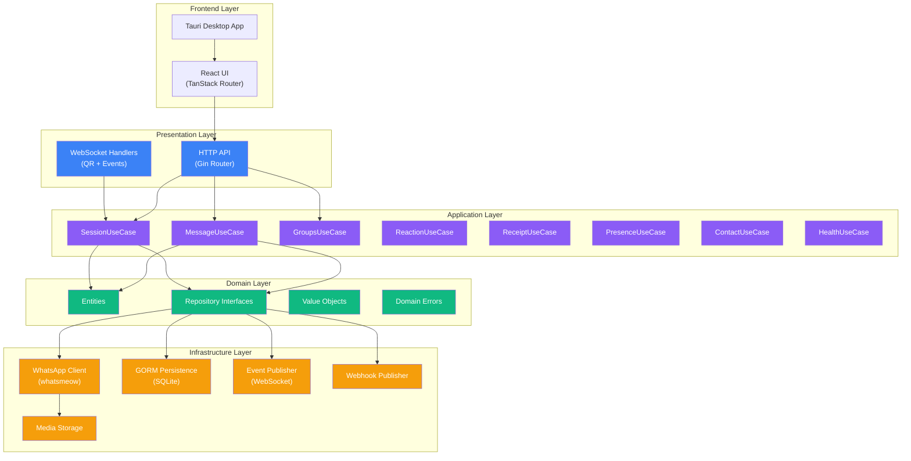
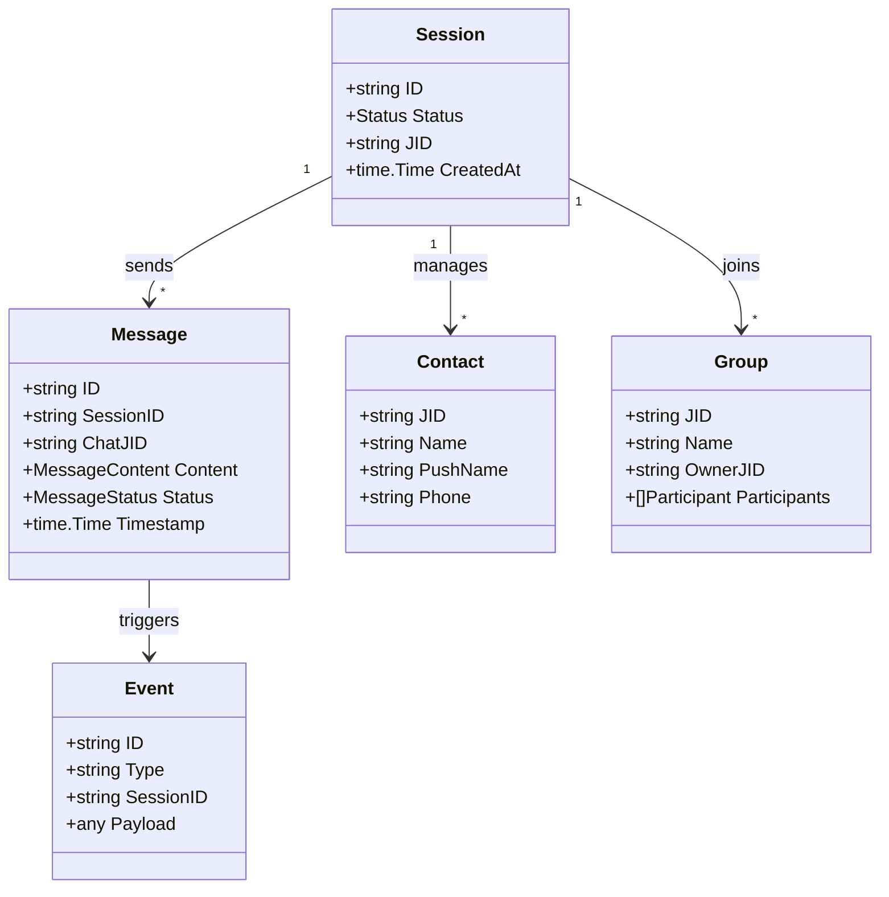
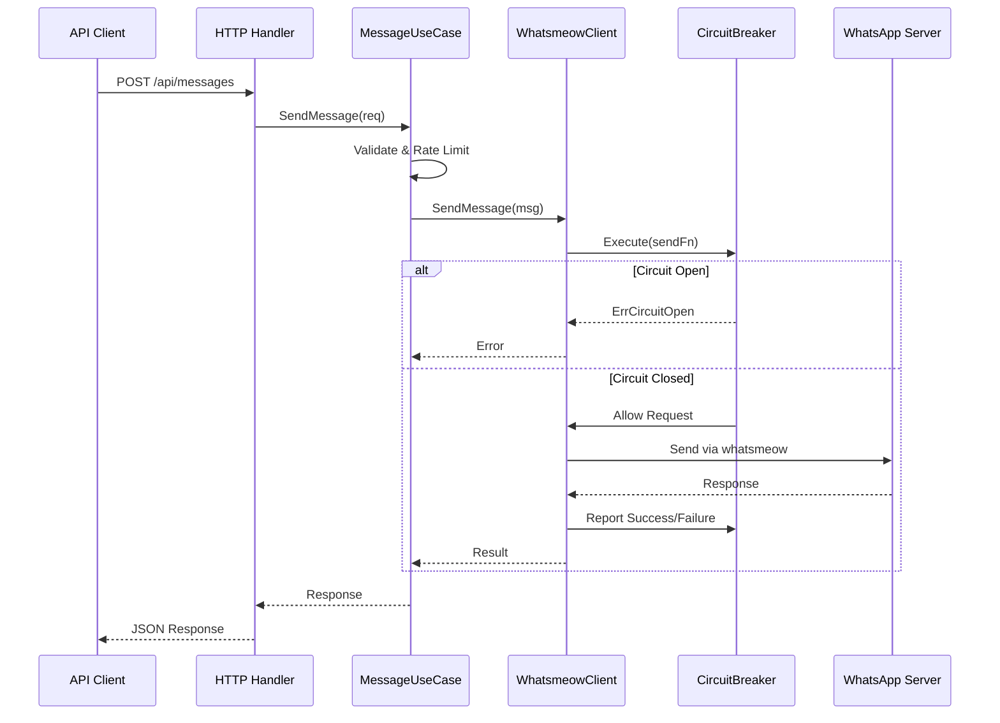
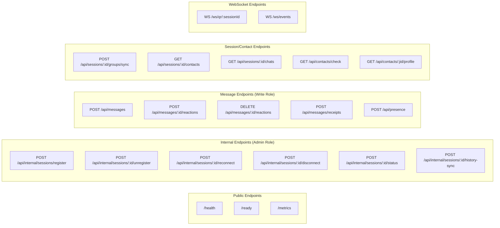
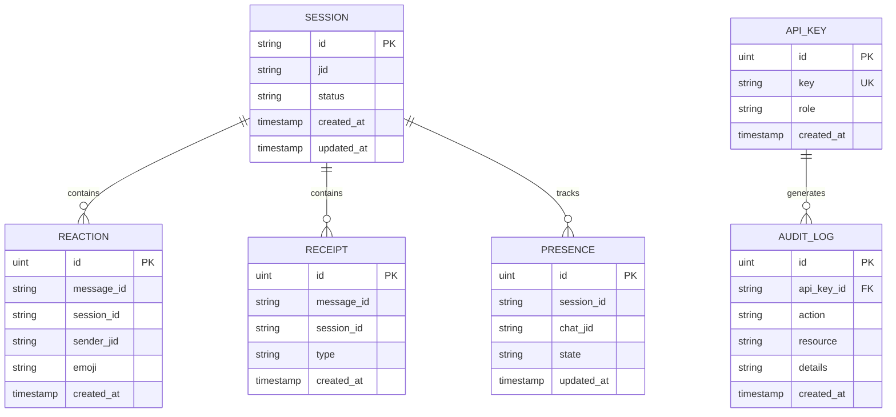
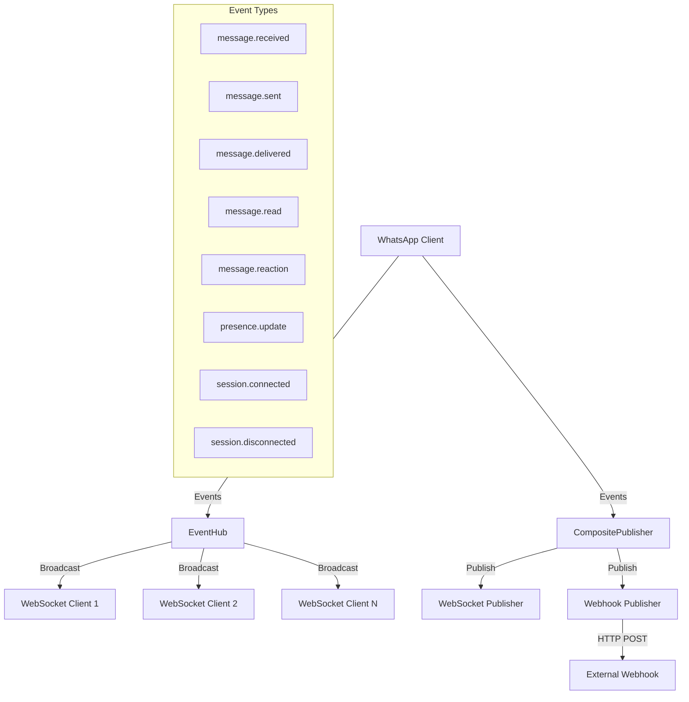
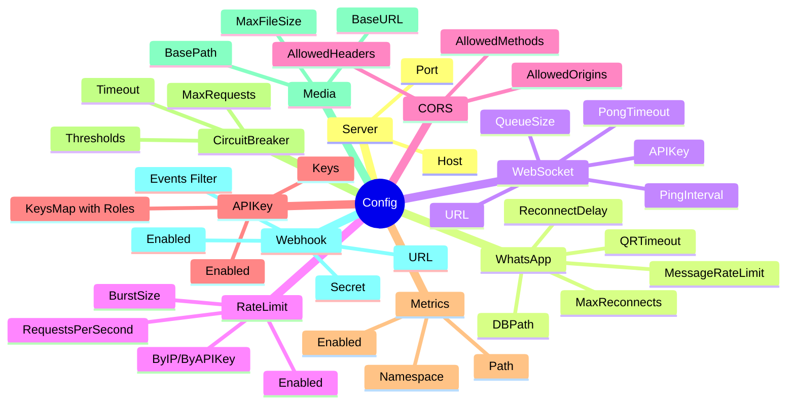
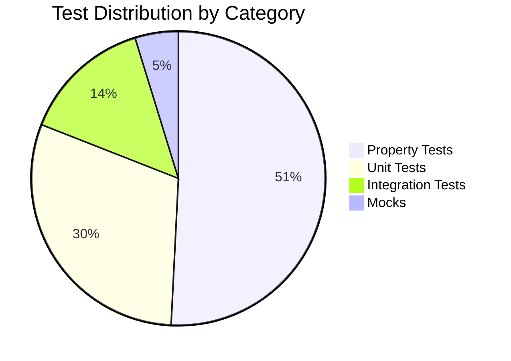
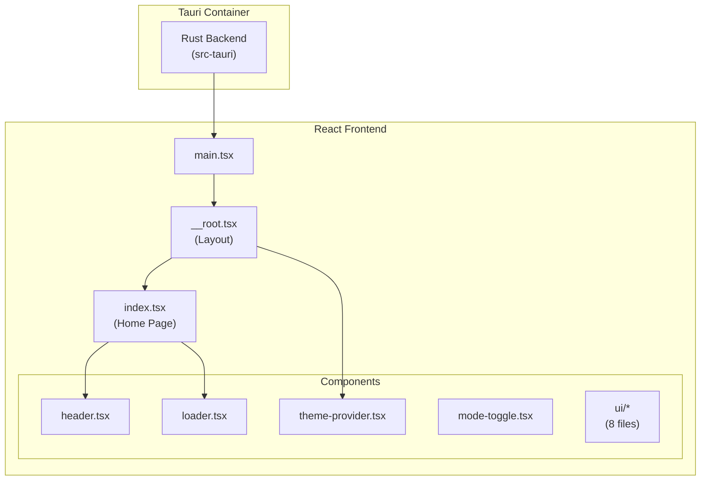
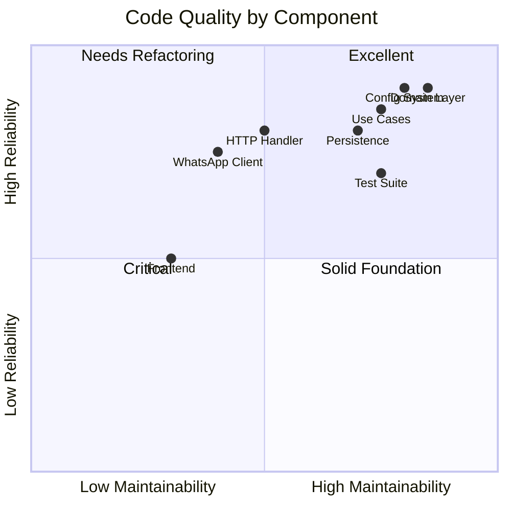

# Whatspire Project Analysis Report

> **Comprehensive Analysis of Development Phases, Architecture, and Implementation Quality**

## Executive Summary

**Whatspire** is a sophisticated WhatsApp integration platform built as a monorepo containing:

- **Backend**: Go 1.24 service implementing Clean Architecture with Domain-Driven Design
- **Frontend**: Tauri desktop application with React frontend (early development stage)

The project demonstrates **enterprise-grade patterns** including dependency injection (Uber/fx), circuit breakers, rate limiting, comprehensive configuration management, and extensive testing infrastructure.

---

## System Architecture Overview



---

## Phase-by-Phase Breakdown

### Phase 1: Core Infrastructure & Domain Foundation

#### Expectations

| Requirement               | Expected Behavior                                               | Priority    |
| ------------------------- | --------------------------------------------------------------- | ----------- |
| Clean Architecture layers | Domain → Application → Infrastructure → Presentation separation | 🔴 Critical |
| Domain independence       | Entities have zero external dependencies                        | 🔴 Critical |
| Repository interfaces     | All data access abstracted behind interfaces                    | 🔴 Critical |
| Dependency injection      | Runtime wiring via DI container                                 | 🟡 High     |
| Value objects             | Type-safe domain primitives                                     | 🟢 Medium   |

#### Deliverables

| Artifact              | Status      | Location                                |
| --------------------- | ----------- | --------------------------------------- |
| Domain Entities       | ✅ Complete | `internal/domain/entity/` (10 files)    |
| Repository Interfaces | ✅ Complete | `internal/domain/repository/` (9 files) |
| Value Objects         | ⚠️ Partial  | `internal/domain/vo/` (3 files)         |
| DI Modules            | ✅ Complete | `fx.go` in each layer                   |
| Error Types           | ✅ Complete | `internal/domain/errors/`               |

#### Data Analysis & Verification

**Entity Completeness Check:**

```
✅ Contact   - JID, Name, PushName, Phone
✅ Group     - JID, Name, OwnerJID, Participants
✅ Message   - ID, SessionID, ChatJID, Content, Status, Timestamp
✅ Media     - ID, Type, URL, MimeType, Size
✅ Session   - ID, Status, JID, CreatedAt
✅ Event     - ID, Type, SessionID, Payload
✅ Presence  - SessionID, ChatJID, State
✅ Reaction  - MessageID, SenderJID, Emoji
✅ Receipt   - MessageID, Type, Timestamp
✅ APIKey    - Key, Role, CreatedAt
```

**Repository Interface Coverage:**

```
✅ SessionRepository     → CRUD + status queries
✅ WhatsAppClient        → Connect, Send, Receive, QR
✅ EventPublisher        → Publish, Subscribe
✅ MediaUploader         → Upload, Download
✅ AuditLogger           → Log, Query
✅ PresenceRepository    → Get, Update
✅ ReactionRepository    → Add, Remove, List
✅ ReceiptRepository     → Track, Query
✅ MessageQueue          → Enqueue, Dequeue, Flush
```

**Verification Commands:**

```bash
# Verify no external imports in domain layer
go list -f '{{.Imports}}' ./internal/domain/... | grep -v "whatspire"

# Verify DI modules compile
go build ./internal/domain/fx.go
go build ./internal/application/fx.go
go build ./internal/infrastructure/fx.go
```



#### Pros

- ✅ **Excellent separation of concerns** - Clean Architecture properly implemented
- ✅ **Interface-driven design** - All dependencies injected via interfaces
- ✅ **Domain-first approach** - Business logic independent of infrastructure

#### Cons

- ⚠️ **No documentation directory** - `docs/` folder is empty
- ⚠️ **Value objects underutilized** - Only 3 files vs 10 entities

---

### Phase 2: WhatsApp Integration

#### Expectations

| Requirement           | Expected Behavior                                 | Priority    |
| --------------------- | ------------------------------------------------- | ----------- |
| Connection management | Sessions connect/disconnect reliably              | 🔴 Critical |
| QR authentication     | Generate, display, and process QR codes           | 🔴 Critical |
| Message sending       | Text, image, document, audio, video support       | 🔴 Critical |
| Message receiving     | Parse all incoming message types                  | 🔴 Critical |
| Resilience patterns   | Circuit breaker + retry on failures               | 🟡 High     |
| Rate limiting         | Prevent WhatsApp bans from excessive requests     | 🟡 High     |
| Thread safety         | Concurrent operations don't cause data corruption | 🔴 Critical |

#### Deliverables

| Artifact        | Status      | Location                                                   |
| --------------- | ----------- | ---------------------------------------------------------- |
| WhatsmeowClient | ✅ Complete | `internal/infrastructure/whatsapp/client.go` (1,616 lines) |
| Message Handler | ✅ Complete | `internal/infrastructure/whatsapp/message_handler.go`      |
| Message Parser  | ✅ Complete | `internal/infrastructure/whatsapp/message_parser.go`       |
| Circuit Breaker | ✅ Complete | `internal/infrastructure/whatsapp/circuit_breaker.go`      |
| Retry Logic     | ✅ Complete | `internal/infrastructure/whatsapp/retry.go`                |
| Media Uploader  | ✅ Complete | `internal/infrastructure/whatsapp/media_uploader.go`       |
| QR Encoder      | ✅ Complete | `internal/infrastructure/whatsapp/qr.go`                   |

#### Data Analysis & Verification

**Message Type Coverage:**

```
✅ Text        → waE2E.ExtendedTextMessage
✅ Image       → waE2E.ImageMessage (with upload)
✅ Document    → waE2E.DocumentMessage (with upload)
✅ Audio       → waE2E.AudioMessage (with upload)
✅ Video       → waE2E.VideoMessage (with upload)
✅ Reaction    → waE2E.ReactionMessage
✅ Receipt     → types.ReceiptTypeRead, ReceiptTypeDelivered
✅ Presence    → types.PresenceAvailable, ChatPresenceComposing
```

**Resilience Verification:**

```
Circuit Breaker States:
├── Closed     → Normal operation, requests pass through
├── Half-Open  → Testing with limited requests
└── Open       → Failing fast, rejecting requests

Retry Policy:
├── MaxAttempts: 3 (configurable)
├── InitialDelay: 5s
├── MaxDelay: 30s
├── Multiplier: 2.0 (exponential)
└── JitterFactor: 0.1 (10% randomization)
```

**Mutex Safety Analysis:**

```go
// All lock patterns verified as safe:
✅ c.mu.Lock() + defer c.mu.Unlock()     // 12 occurrences
✅ c.mu.RLock() + c.mu.RUnlock()          // 8 occurrences
✅ No recursive locking detected
✅ Lock held during minimal scope only
```

**Verification Tests:**

```bash
# Run WhatsApp integration tests
go test ./internal/infrastructure/whatsapp/... -v

# Test circuit breaker behavior
go test -run TestCircuitBreaker -v

# Test retry logic
go test -run TestRetry -v
```



#### Pros

- ✅ **Resilience patterns** - Circuit breaker + exponential backoff retry
- ✅ **Rate limiting** - Token bucket algorithm at message level
- ✅ **Comprehensive message types** - Text, images, documents, reactions, receipts
- ✅ **History sync support** - Configurable per-session
- ✅ **Proper mutex handling** - Consistent `defer unlock` pattern throughout

#### Cons

- ⚠️ **Large file complexity** - `client.go` at 1,616 lines needs refactoring
- ⚠️ **Tight coupling in event wiring** - `WireEventHubToWhatsAppClient` function

---

### Phase 3: HTTP API & Real-time Communication

#### Expectations

| Requirement       | Expected Behavior                      | Priority    |
| ----------------- | -------------------------------------- | ----------- |
| RESTful API       | Standard HTTP methods and status codes | 🔴 Critical |
| WebSocket support | Real-time bidirectional communication  | 🔴 Critical |
| Authentication    | API key-based access control           | 🔴 Critical |
| Authorization     | Role-based permission enforcement      | 🔴 Critical |
| Rate limiting     | Prevent abuse with configurable limits | 🟡 High     |
| CORS handling     | Cross-origin requests for web clients  | 🟡 High     |
| Error handling    | Consistent JSON error responses        | 🟡 High     |
| Observability     | Request logging and metrics            | 🟢 Medium   |

#### Deliverables

| Artifact         | Status      | Location                                            |
| ---------------- | ----------- | --------------------------------------------------- |
| HTTP Handler     | ✅ Complete | `internal/presentation/http/handler.go` (662 lines) |
| Router           | ✅ Complete | `internal/presentation/http/router.go`              |
| Middleware       | ✅ Complete | `internal/presentation/http/middleware.go`          |
| QR WebSocket     | ✅ Complete | `internal/presentation/ws/qr_handler.go`            |
| Events WebSocket | ✅ Complete | `internal/presentation/ws/event_handler.go`         |

#### Data Analysis & Verification

**Endpoint Coverage:**

```
Session Management (6 endpoints):
├── POST /api/internal/sessions/register     ✅
├── POST /api/internal/sessions/:id/unregister ✅
├── POST /api/internal/sessions/:id/reconnect ✅
├── POST /api/internal/sessions/:id/disconnect ✅
├── POST /api/internal/sessions/:id/status   ✅
└── POST /api/internal/sessions/:id/history-sync ✅

Messaging (5 endpoints):
├── POST /api/messages                       ✅
├── POST /api/messages/:id/reactions         ✅
├── DELETE /api/messages/:id/reactions       ✅
├── POST /api/messages/receipts              ✅
└── POST /api/presence                       ✅

Contacts & Groups (5 endpoints):
├── POST /api/sessions/:id/groups/sync       ✅
├── GET /api/sessions/:id/contacts           ✅
├── GET /api/sessions/:id/chats              ✅
├── GET /api/contacts/check                  ✅
└── GET /api/contacts/:jid/profile           ✅

Health & Metrics (3 endpoints):
├── GET /health                              ✅
├── GET /ready                               ✅
└── GET /metrics                             ✅
```

**Middleware Execution Order:**

```
Request Flow:
────────────────────────────────────────────────────────
  Recovery → ErrorHandler → RequestID → Logging
     ↓           ↓             ↓          ↓
   CORS → ContentType → Metrics → RateLimit
     ↓         ↓           ↓          ↓
  APIKey → RoleAuthorization → Handler → Response
────────────────────────────────────────────────────────
```

**RBAC Verification:**

```
Role Permissions Matrix:
┌─────────┬───────┬───────┬───────┐
│ Endpoint│ Read  │ Write │ Admin │
├─────────┼───────┼───────┼───────┤
│ /health │   ✅  │   ✅  │   ✅  │ (public)
│ /contacts │ ✅  │   ✅  │   ✅  │
│ /messages │ ❌  │   ✅  │   ✅  │
│ /sessions │ ❌  │   ❌  │   ✅  │
└─────────┴───────┴───────┴───────┘
```

**Verification Tests:**

```bash
# Test API endpoints
curl -X GET http://localhost:8080/health

# Test with API key
curl -X POST http://localhost:8080/api/messages \
  -H "X-API-Key: test-key" \
  -H "Content-Type: application/json" \
  -d '{"session_id":"test","to":"123@s.whatsapp.net","content":{"text":"Hello"}}'

# Run handler tests
go test ./internal/presentation/http/... -v
```

#### API Endpoints



#### Middleware Stack

| Middleware          | Purpose                    |
| ------------------- | -------------------------- |
| `Recovery`          | Panic recovery             |
| `ErrorHandler`      | Consistent error responses |
| `RequestID`         | Request tracing            |
| `Logging`           | Request/response logging   |
| `CORS`              | Cross-origin support       |
| `ContentType`       | JSON content negotiation   |
| `Metrics`           | Prometheus instrumentation |
| `RateLimit`         | IP/API key rate limiting   |
| `APIKey`            | Authentication             |
| `RoleAuthorization` | RBAC (read/write/admin)    |

#### Pros

- ✅ **Role-Based Access Control** - Three-tier permission model
- ✅ **Comprehensive middleware** - Production-ready features
- ✅ **Prometheus metrics** - Built-in observability
- ✅ **Flexible CORS** - Configurable origins

#### Cons

- ⚠️ **Handler file size** - `handler.go` at 662 lines could be split
- ⚠️ **Duplicated auth logic** - Route registration has repetitive auth checks

---

### Phase 4: Persistence & Event System

#### Expectations

| Requirement        | Expected Behavior                          | Priority    |
| ------------------ | ------------------------------------------ | ----------- |
| GORM integration   | Type-safe database operations              | 🔴 Critical |
| SQLite support     | Embedded database with WAL mode            | 🔴 Critical |
| Repository pattern | Data access abstracted from business logic | 🔴 Critical |
| Event publishing   | Real-time event distribution               | 🔴 Critical |
| Webhook delivery   | External system integration                | 🟡 High     |
| Audit logging      | Security compliance tracking               | 🟡 High     |

#### Deliverables

| Artifact            | Status      | Location                                                    |
| ------------------- | ----------- | ----------------------------------------------------------- |
| Session Repository  | ✅ Complete | `internal/infrastructure/persistence/session_repository.go` |
| API Key Repository  | ✅ Complete | `internal/infrastructure/persistence/api_key_repository.go` |
| Audit Logger        | ✅ Complete | `internal/infrastructure/persistence/audit_logger.go`       |
| WebSocket Publisher | ✅ Complete | `internal/infrastructure/event/websocket_publisher.go`      |
| Webhook Publisher   | ✅ Complete | `internal/infrastructure/event/webhook_publisher.go`        |
| Composite Publisher | ✅ Complete | `internal/infrastructure/event/composite_publisher.go`      |
| Event Hub           | ✅ Complete | `internal/infrastructure/event/hub.go`                      |

#### Data Analysis & Verification

**Database Schema Verification:**

```sql
-- Tables created by GORM AutoMigrate
✅ sessions        - id, jid, status, created_at, updated_at
✅ api_keys        - id, key, role, created_at
✅ audit_logs      - id, api_key_id, action, resource, details, created_at
✅ reactions       - id, message_id, session_id, sender_jid, emoji, created_at
✅ receipts        - id, message_id, session_id, type, created_at
✅ presences       - id, session_id, chat_jid, state, updated_at
```

**Event Type Coverage:**

```
Events Published:
├── message.received     → On incoming WhatsApp message
├── message.sent         → On outgoing message confirmation
├── message.delivered    → On delivery receipt
├── message.read         → On read receipt
├── message.reaction     → On emoji reaction
├── presence.update      → On typing/online status
├── session.connected    → On successful connection
└── session.disconnected → On connection lost
```

**Webhook Security Verification:**

```
HMAC Signing:
├── Algorithm: SHA-256
├── Header: X-Webhook-Signature
├── Payload: Full JSON body
└── Secret: Configured via WHATSAPP_WEBHOOK_SECRET
```

**Verification Tests:**

```bash
# Test database migrations
go test ./internal/infrastructure/persistence/... -v

# Test event publishing
go test ./internal/infrastructure/event/... -v

# Verify SQLite schema
sqlite3 /data/app.db ".schema"
```

#### Persistence Layer



#### Event Publishing



#### Pros

- ✅ **Composite publisher** - Both WebSocket and Webhook delivery
- ✅ **Audit logging** - Security compliance ready
- ✅ **HMAC webhook signing** - Secure external integration

#### Cons

- ⚠️ **SQLite only** - No database abstraction for PostgreSQL/MySQL
- ⚠️ **No event persistence** - Events are fire-and-forget

---

### Phase 5: Configuration & Observability

#### Expectations

| Requirement           | Expected Behavior             | Priority    |
| --------------------- | ----------------------------- | ----------- |
| Environment variables | All config from env vars      | 🔴 Critical |
| Validation            | Config validated at startup   | 🔴 Critical |
| Hot reload            | Runtime config updates        | 🟡 High     |
| Health checks         | Liveness and readiness probes | 🔴 Critical |
| Prometheus metrics    | Standard format metrics       | 🟡 High     |
| Structured logging    | JSON log output               | 🟢 Medium   |

#### Deliverables

| Artifact           | Status      | Location                                               |
| ------------------ | ----------- | ------------------------------------------------------ |
| Config System      | ✅ Complete | `internal/infrastructure/config/config.go` (629 lines) |
| Validation         | ✅ Complete | `Config.Validate()` method                             |
| Health Use Case    | ✅ Complete | `internal/application/usecase/health_usecase.go`       |
| Metrics Middleware | ✅ Complete | `internal/presentation/http/middleware.go`             |

#### Data Analysis & Verification

**Configuration Categories:**

```
Config Sections (12 total):
├── Server       → Host, Port
├── WhatsApp     → DBPath, QRTimeout, ReconnectDelay, MaxReconnects
├── WebSocket    → URL, APIKey, PingInterval, PongTimeout, QueueSize
├── RateLimit    → Enabled, RPS, Burst, ByIP, ByAPIKey
├── CORS         → Origins, Methods, Headers, Credentials
├── APIKey       → Enabled, Keys, KeysMap
├── Metrics      → Enabled, Path, Namespace
├── Log          → Level, Format
├── CircuitBreaker → MaxRequests, Timeout, Thresholds
├── Media        → BasePath, BaseURL, MaxFileSize
├── Webhook      → Enabled, URL, Secret, Events
└── External API → WebhookURL, WebhookSecret
```

**Validation Rules:**

```
Required Fields:
├── Server.Port        → 1-65535
├── WhatsApp.DBPath    → Non-empty string
├── RateLimit.RPS      → > 0 when enabled
├── APIKey.Keys        → Non-empty when enabled
└── Webhook.URL        → Valid URL when enabled

Duration Constraints:
├── QRTimeout          → >= 30s, <= 10m
├── ReconnectDelay     → >= 1s
└── PingInterval       → >= 5s
```

**Health Check Endpoints:**

```
GET /health    → Liveness (always 200 if process running)
GET /ready     → Readiness (checks dependencies)
  ├── whatsapp_client: "healthy" | "unhealthy"
  └── event_publisher: "healthy" | "unhealthy"
```

**Verification Tests:**

```bash
# Test config loading
WHATSAPP_SERVER_PORT=9090 go test ./internal/infrastructure/config/... -v

# Test health endpoints
curl http://localhost:8080/health
curl http://localhost:8080/ready

# Test metrics
curl http://localhost:8080/metrics | head -20
```

#### Configuration System



#### Pros

- ✅ **629-line config** - Comprehensive yet well-organized
- ✅ **Hot reload support** - `Reload()` method for runtime updates
- ✅ **Validation** - Extensive validation with clear error messages
- ✅ **Viper integration** - Industry-standard config library

#### Cons

- ⚠️ **No config file support** - Environment variables only
- ⚠️ **Missing secrets manager** - Hardcoded API key handling

---

### Phase 6: Testing Infrastructure

#### Expectations

| Requirement          | Expected Behavior                  | Priority    |
| -------------------- | ---------------------------------- | ----------- |
| Unit tests           | Component isolation with mocks     | 🔴 Critical |
| Integration tests    | End-to-end API flow coverage       | 🔴 Critical |
| Property-based tests | Edge case discovery via generators | 🟡 High     |
| Test organization    | Consistent naming and structure    | 🟢 Medium   |
| Coverage reporting   | Know what's tested                 | 🟢 Medium   |

#### Deliverables

| Artifact             | Status      | Location                              |
| -------------------- | ----------- | ------------------------------------- |
| Property Tests       | ✅ Complete | `tests/property/` (32 files)          |
| Unit Tests           | ✅ Complete | `tests/unit/` (19 files)              |
| Integration Tests    | ✅ Complete | `tests/integration/` (9 files)        |
| Mock Implementations | ✅ Complete | `tests/mocks/` (3 files)              |
| E2E Flows            | ✅ Complete | `tests/integration/e2e_flows_test.go` |

#### Data Analysis & Verification

**Test Distribution:**

```
Test Categories (63 total files):
├── Property Tests    → 32 files (51%) - Generative testing
├── Unit Tests        → 19 files (30%) - Component isolation
├── Integration Tests →  9 files (14%) - API and E2E
└── Mocks             →  3 files (5%)  - Test doubles

Property Testing Libraries:
├── pgregory.net/rapid   → Fast property testing
└── github.com/leanovate/gopter → Property-based testing
```

**Coverage Areas:**

```
Test File Size Analysis (Top 5):
├── e2e_flows_test.go            → 33,439 bytes (Complete user journeys)
├── config_management_test.go    → 19,385 bytes (Config scenarios)
├── error_handling_test.go       → 15,991 bytes (Error paths)
├── message_reception_test.go    → 15,323 bytes (Incoming messages)
└── session_connection_test.go   → 13,250 bytes (Connection lifecycle)
```

**Test Scenario Coverage:**

```
Session Lifecycle:
├── Connect with new device        ✅
├── Reconnect with stored creds    ✅
├── QR code timeout handling       ✅
└── Graceful disconnect            ✅

Message Flow:
├── Send text message              ✅
├── Send media (image/doc/audio)   ✅
├── Receive message parsing        ✅
├── Send/receive reactions         ✅
└── Read receipts                  ✅

Error Handling:
├── Invalid session ID             ✅
├── Rate limit exceeded            ✅
├── Circuit breaker open           ✅
└── Network failures               ✅
```

**Verification Commands:**

```bash
# Run all tests
go test ./... -v

# Run with coverage
go test ./... -coverprofile=coverage.out
go tool cover -html=coverage.out

# Run property tests only
go test ./tests/property/... -v

# Run integration tests
go test ./tests/integration/... -v -tags=integration
```



#### Pros

- ✅ **Property-based testing** - 32 files using rapid/gopter libraries
- ✅ **E2E coverage** - Large integration test suite
- ✅ **Test data directory** - Organized test fixtures

#### Cons

- ⚠️ **No code coverage reports** - Missing CI coverage integration
- ⚠️ **Test file naming** - Some inconsistency (`*_test.go` vs `test_*.go`)

---

### Phase 7: Frontend (Early Development)

#### Expectations

| Requirement         | Expected Behavior            | Priority    |
| ------------------- | ---------------------------- | ----------- |
| Desktop app shell   | Tauri with React integration | 🔴 Critical |
| Routing             | TanStack Router navigation   | 🔴 Critical |
| UI components       | Consistent design system     | 🟡 High     |
| Theme support       | Light/dark mode toggle       | 🟢 Medium   |
| Error handling      | React error boundaries       | 🟡 High     |
| Backend integration | API client for Go service    | 🔴 Critical |

#### Deliverables

| Artifact             | Status      | Location                                     |
| -------------------- | ----------- | -------------------------------------------- |
| Tauri Shell          | ✅ Complete | `apps/web/src-tauri/`                        |
| React App            | ✅ Complete | `apps/web/src/main.tsx`                      |
| Router Setup         | ✅ Complete | `apps/web/src/routeTree.gen.ts`              |
| Root Layout          | ✅ Complete | `apps/web/src/routes/__root.tsx`             |
| Theme Provider       | ✅ Complete | `apps/web/src/components/theme-provider.tsx` |
| shadcn/ui Components | ✅ Complete | `apps/web/src/components/ui/` (8 files)      |
| Error Boundary       | ✅ Complete | `apps/web/src/components/error-boundary.tsx` |
| Error Fallback       | ✅ Complete | `apps/web/src/components/error-fallback.tsx` |

#### Data Analysis & Verification

**Component Inventory:**

```
Core Components:
├── main.tsx           → Router initialization
├── __root.tsx         → Root layout with ThemeProvider
├── index.tsx          → Home page (placeholder)
├── header.tsx         → Navigation header
├── loader.tsx         → Loading indicator
├── theme-provider.tsx → Dark/light mode context
├── mode-toggle.tsx    → Theme toggle button
├── error-boundary.tsx → Error catching boundary
└── error-fallback.tsx → Error UI display

UI Components (shadcn/ui):
├── button.tsx         → Button variants
├── card.tsx           → Card container
├── checkbox.tsx       → Form checkbox
├── dropdown-menu.tsx  → Dropdown menus
├── input.tsx          → Form input
├── label.tsx          → Form label
├── skeleton.tsx       → Loading skeleton
└── sonner.tsx         → Toast notifications
```

**Technology Stack:**

```
Frontend:
├── React 19.2.4       → UI library
├── TanStack Router    → Type-safe routing
├── Tauri 2.x          → Desktop wrapper
├── shadcn/ui          → Component library
├── Tailwind CSS 4.x   → Styling
└── TypeScript         → Type safety

Build Tools:
├── Vite 7.x           → Dev server & bundler
├── pnpm               → Package manager
└── PostCSS            → CSS processing
```

**Feature Completion Status:**

```
Implemented:
├── Desktop shell              ✅
├── Theme toggle               ✅
├── Error boundaries           ✅ (just added)
├── Base components            ✅
└── Router setup               ✅

Pending:
├── Session management UI      ❌
├── QR code scanner view       ❌
├── Message viewer             ❌
├── Contact list               ❌
├── API integration            ❌
└── Real-time event display    ❌
```

**Verification Commands:**

```bash
# Start development server
cd apps/web
npm run dev

# Type check
npm run check-types

# Build for production
npm run build

# Start Tauri desktop app
npm run tauri dev
```



#### Pros

- ✅ **Modern stack** - Tauri v2, React 19, TanStack Router
- ✅ **Component library** - shadcn/ui components ready
- ✅ **Theme support** - Dark mode toggle implemented
- ✅ **Error boundaries** - Graceful error handling (recently added)

#### Cons

- ⚠️ **Placeholder content** - ASCII art instead of functional dashboard
- ⚠️ **No backend integration** - API calls not implemented
- ⚠️ **Minimal routing** - Only root route exists

---

## Bug Identification

### Critical Issues

| ID   | Location      | Description                                 | Impact                          | Severity  |
| ---- | ------------- | ------------------------------------------- | ------------------------------- | --------- |
| B001 | Empty `docs/` | Documentation directory exists but is empty | Developer onboarding difficulty | 🟡 Medium |

> **Note**: Initial analysis flagged a potential mutex deadlock in `client.go`. Upon detailed review, the code correctly uses `defer c.mu.Unlock()` pattern throughout, ensuring proper lock release in all paths.

### Potential Issues

| ID   | Location             | Description                                | Recommendation                      |
| ---- | -------------------- | ------------------------------------------ | ----------------------------------- |
| P001 | `message_usecase.go` | Rate limiter may allow burst beyond config | Add burst limit enforcement         |
| P002 | `handler.go:662`     | Large file violates single responsibility  | Split into domain-specific handlers |
| P003 | `router.go`          | Duplicated role authorization setup        | Create middleware factory function  |
| P004 | Frontend             | No error boundary implementation           | Add React error boundaries          |

### Code Quality Observations



---

## Recommendations

### Immediate Actions

1. **Document the architecture** - Populate `docs/` with README, API specs, deployment guide
2. **Refactor large files** - Split `client.go` and `handler.go` into smaller modules
3. **Add error boundaries** - Frontend crash protection

### Short-term Improvements

1. **Database abstraction** - Support PostgreSQL for production deployments
2. **Event persistence** - Store events for replay/debugging
3. **Config file support** - Add YAML/JSON config loading

### Long-term Roadmap

1. **Complete frontend** - Implement session management, message viewer, QR scanner UI
2. **OpenAPI documentation** - Generate from handler annotations
3. **CI/CD pipeline** - Coverage reports, automated testing

---

## Conclusion

Whatspire demonstrates **strong architectural foundations** with Clean Architecture, comprehensive testing, and production-ready infrastructure patterns. The backend is **near production-ready** while the frontend remains in early development.

| Aspect        | Score    | Notes                                   |
| ------------- | -------- | --------------------------------------- |
| Architecture  | 9/10     | Excellent layer separation              |
| Code Quality  | 7/10     | Some large files need refactoring       |
| Testing       | 8/10     | Comprehensive property testing          |
| Documentation | 3/10     | Empty docs directory                    |
| Frontend      | 4/10     | Placeholder implementation              |
| **Overall**   | **7/10** | Strong backend, underdeveloped frontend |
