# Frontend-Backend Integration Analysis

> **Whatspire v2.0.0** | Analysis Date: 2026-02-07

## Executive Summary

| Metric | Value | Status |
|--------|-------|--------|
| Backend Endpoints | 25+ | ✅ Complete |
| Frontend Routes | 7 | ✅ Complete |
| Integration Coverage | ~60% | ⚠️ Gaps Exist |
| Critical Gaps | 2 | 🔴 Action Required |

---

## 1. Frontend Review

### Route Integration Status

```mermaid
graph LR
    subgraph "✅ Fully Integrated"
        D["/ Dashboard"]
        SL["sessions/"]
        SN["sessions/new"]
        SD["sessions/$id"]
        AK["settings/api-keys"]
    end
    
    subgraph "⚠️ Partial/Mock"
        C["contacts/"]
        SG["settings/general"]
    end
    
    subgraph "❌ Missing Route"
        M["messages/"]
    end
```



### Detailed Route Analysis

| Route | Component | Backend Integration | Issues |
|-------|-----------|---------------------|--------|
| `/` | `HomeComponent` | ✅ `useSessions`, `useSessionEvents` | None |
| `/sessions` | `SessionsComponent` | ✅ `useSessions`, `useSessionEvents` | None |
| `/sessions/new` | `NewSessionPage` | ✅ `useCreateSession` | None |
| `/sessions/$id` | `SessionDetailsPage` | ✅ `useSession`, `useDeleteSession` | None |
| `/contacts` | `ContactsComponent` | ❌ **MOCK_CONTACTS** | Critical gap |
| `/settings` | `Settings` | ⚠️ Local state only | Not persisted |
| `/settings/api-keys` | `APIKeySettings` | ✅ `useAPIKeys` | None |

### Components with Integration Issues

#### 🔴 Critical: ContactList (Mock Data)

```typescript
// apps/web/src/components/contacts/contact-list.tsx:31
const MOCK_CONTACTS: Contact[] = [
  { id: "1", name: "John Doe", phoneNumber: "+1234567890", ... },
  // ... hardcoded mock data
];
```

**Available but unused hooks:**
- `useContacts(client, sessionId)` - Lists contacts for session
- `useContactProfile(client, sessionId, jid)` - Gets contact profile
- `useChats(client, sessionId)` - Lists chats
- `useCheckPhone(client, sessionId, phone)` - Validates phone

#### ⚠️ Settings Component (Not Persisted)

```typescript
// apps/web/src/components/settings/settings.tsx
const [apiEndpoint, setApiEndpoint] = useState("https://api.whatspire.com");
const [apiKey, setApiKey] = useState("");
// These values are lost on page refresh
```

---

## 2. Backend API Inventory

### Endpoint Categories


### Complete Endpoint List

| Category | Endpoint | Method | Frontend Usage |
|----------|----------|--------|----------------|
| **Health** | `/health` | GET | ❌ Not used |
| | `/ready` | GET | ❌ Not used |
| | `/metrics` | GET | ❌ Not used |
| **Sessions** | `/api/sessions` | POST | ✅ `useCreateSession` |
| | `/api/sessions` | GET | ✅ `useSessions` |
| | `/api/sessions/:id` | GET | ✅ `useSession` |
| | `/api/sessions/:id` | DELETE | ✅ `useDeleteSession` |
| | `/api/sessions/:id/contacts` | GET | ❌ **Not used** |
| | `/api/sessions/:id/chats` | GET | ❌ **Not used** |
| | `/api/sessions/:id/groups/sync` | POST | ❌ Not used |
| **Contacts** | `/api/contacts/check` | GET | ❌ Not used |
| | `/api/contacts/:jid/profile` | GET | ❌ Not used |
| **Messages** | `/api/messages` | POST | ❌ **Not used** |
| | `/api/messages/:id/reactions` | POST | ❌ Not used |
| | `/api/messages/:id/reactions` | DELETE | ❌ Not used |
| | `/api/messages/receipts` | POST | ❌ Not used |
| **Events** | `/api/events` | GET | ❌ Not used |
| | `/api/events/:id` | GET | ❌ Not used |
| | `/api/events/replay` | POST | ❌ Not used |
| **API Keys** | `/api/apikeys` | POST | ✅ `useCreateAPIKey` |
| | `/api/apikeys` | GET | ✅ `useAPIKeys` |
| | `/api/apikeys/:id` | GET | ✅ `useAPIKeyDetails` |
| | `/api/apikeys/:id` | DELETE | ✅ `useRevokeAPIKey` |
| **Presence** | `/api/presence` | POST | ❌ Not used |

---

## 3. Integration Gap Mapping

### Gap Priority Matrix


### Gap Details

| ID | Gap | Impact | Effort | Priority |
|----|-----|--------|--------|----------|
| G1 | Contacts uses mock data | 🔴 High | Low | **P0** |
| G2 | No messages route | 🔴 High | Medium | **P1** |
| G3 | Settings not persisted | 🟡 Medium | Low | **P2** |
| G4 | Health endpoints unused | 🟢 Low | Very Low | P3 |
| G5 | Events viewer missing | 🟡 Medium | Medium | P3 |

---

## 4. Project Phase Framework

### Phase Lifecycle


### Phase 1: Initiation

| Aspect | Details |
|--------|---------|
| **Objectives** | Define integration requirements, identify gaps |
| **Stakeholders** | Dev team, product owner, QA |
| **Success Criteria** | Complete gap analysis, prioritized backlog |
| **Deliverables** | This analysis report |
| **KPIs** | Gap count, coverage percentage |

### Phase 2: Planning

| Aspect | Details |
|--------|---------|
| **Objectives** | Design solutions, estimate effort |
| **Deliverables** | Technical specs, sprint plan |
| **Data Analysis** | API response times, error rates |
| **Validation** | Peer review, feasibility checks |
| **Risks** | Scope creep, API changes |

### Phase 3: Execution (Critical Gaps)

| Gap | Implementation Steps |
|-----|---------------------|
| **G1: Contacts** | 1. Add session selector to contacts route<br/>2. Replace mock data with `useContacts(client, sessionId)`<br/>3. Connect sync button to API |
| **G2: Messages** | 1. Create `/messages` route<br/>2. Implement `useSendMessage` hook usage<br/>3. Build message composer UI |
| **G3: Settings** | 1. Store in localStorage or Zustand<br/>2. Sync to WhatspireProvider config |

### Phase 4: Monitoring

| KPI | Target | Measurement |
|-----|--------|-------------|
| Integration Coverage | >90% | Endpoints with frontend usage |
| Error Rate | <1% | API errors / total requests |
| Response Time | <200ms | P95 latency |
| Test Coverage | >80% | Lines covered |

### Phase 5: Closure

| Deliverable | Description |
|-------------|-------------|
| Updated Documentation | Sync docs with implementation |
| Walkthrough | Demo new integrations |
| Retrospective | Lessons learned |

---

## 5. Recommendations

### Priority Actions

| Priority | Action | Effort | Impact |
|----------|--------|--------|--------|
| **P0** | Replace `ContactList` mock data with `useContacts` hook | 2h | 🔴 Critical |
| **P1** | Add session selector dropdown to contacts page | 1h | 🔴 High |
| **P2** | Create `/messages` route with send functionality | 4h | 🔴 High |
| **P3** | Persist settings (localStorage/Zustand) | 1h | 🟡 Medium |
| **P4** | Add health status indicator to dashboard | 30m | 🟢 Low |

### G1 Fix: Contacts Integration

```tsx
// Recommended change to contact-list.tsx
import { useApiClient, useContacts } from "@whatspire/hooks";

export function ContactList({ sessionId, onSync }: ContactListProps) {
  const client = useApiClient();
  const { data: contacts, isLoading, refetch } = useContacts(
    client, 
    sessionId,
    { enabled: !!sessionId }
  );
  
  // Remove MOCK_CONTACTS usage
  // Replace useState with query data
}
```

### Risk Mitigation

| Risk | Mitigation |
|------|-----------|
| API breaks during integration | Add error boundaries, fallback UI |
| Session selection complexity | Default to first connected session |
| Performance on large contact lists | Implement virtual scrolling |

---

## Summary

The project has a **solid backend (25+ endpoints)** and a **well-structured frontend**, but ~40% of backend capabilities remain unused. The most critical gap is the **Contacts module using mock data** despite having ready-to-use hooks (`useContacts`, `useContactProfile`). 

**Recommended Sprint Focus:**
1. Fix contacts integration (P0) - 3 hours
2. Add messages route (P1) - 4 hours  
3. Settings persistence (P2) - 1 hour

Total estimated effort for full integration: **~8 hours**
