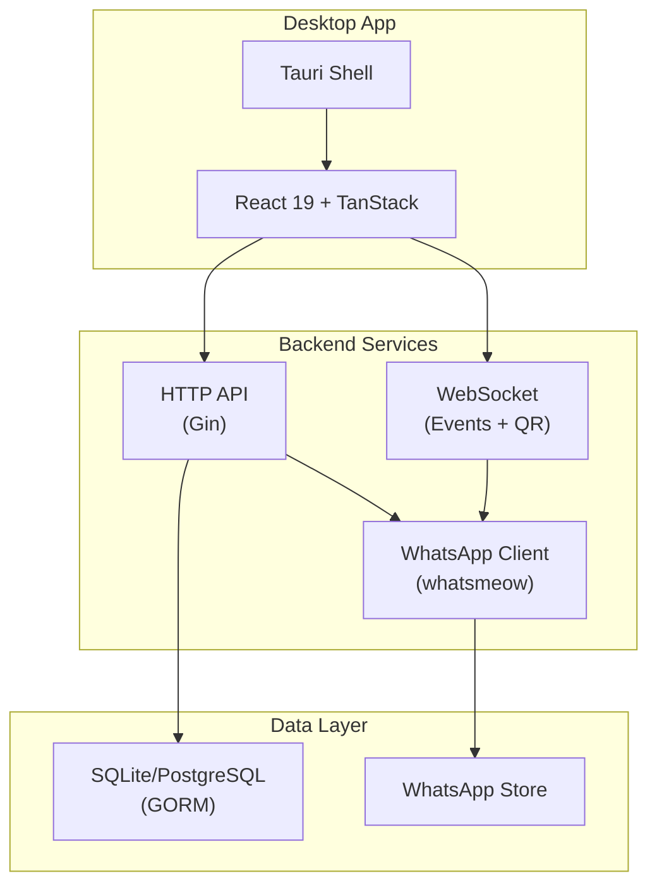
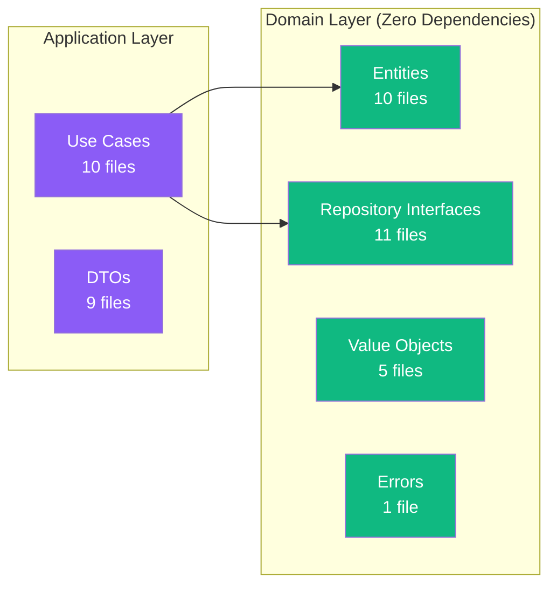
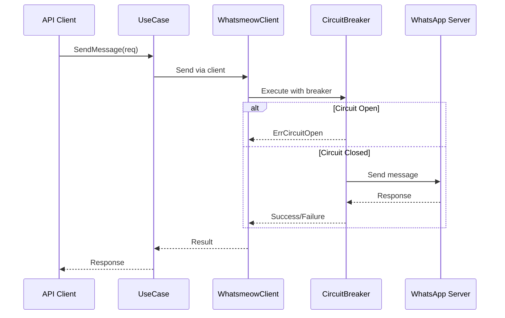
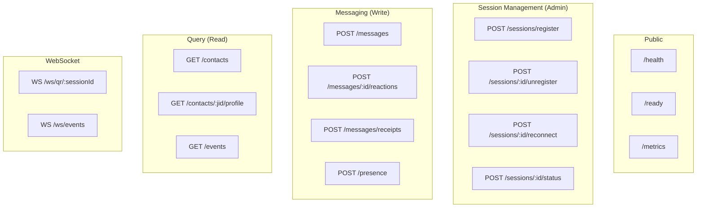
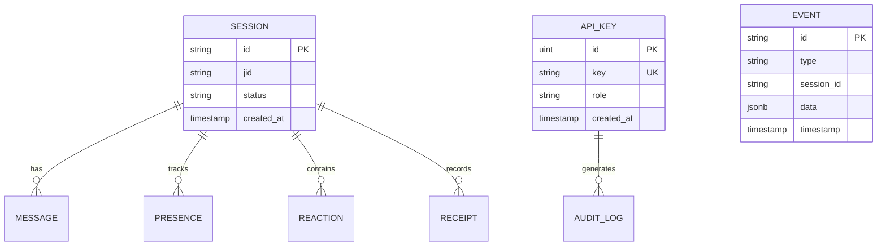
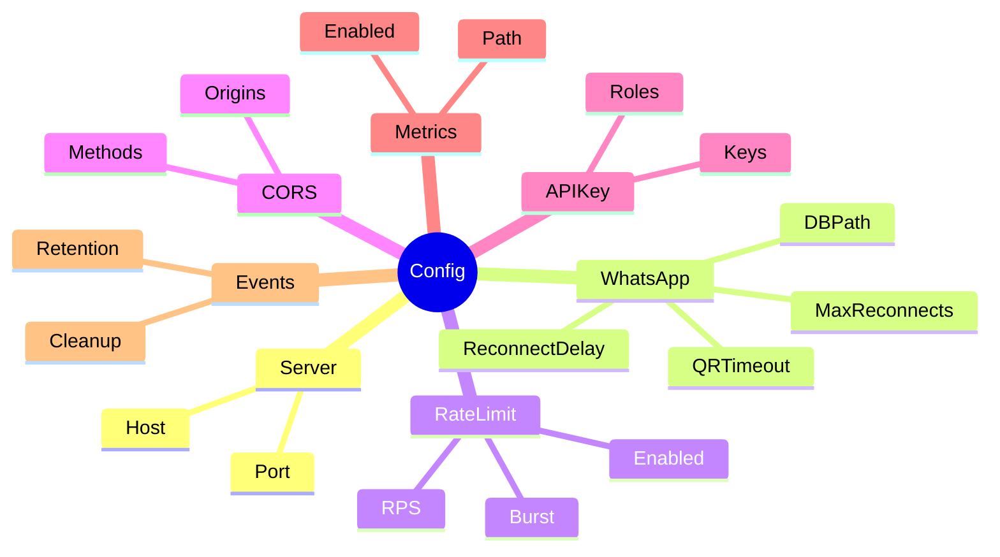
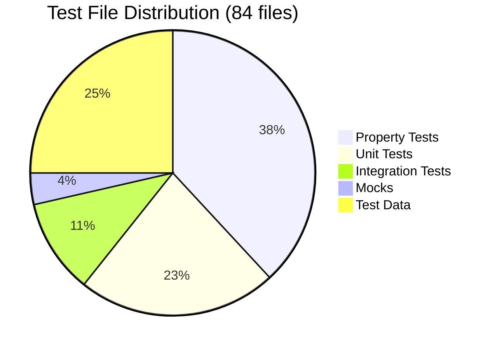
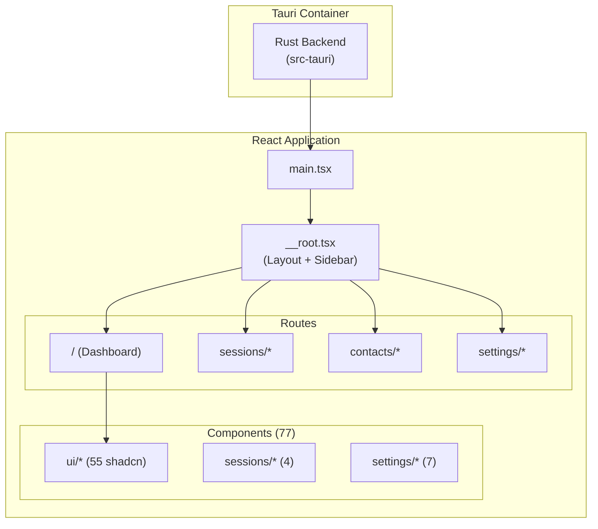
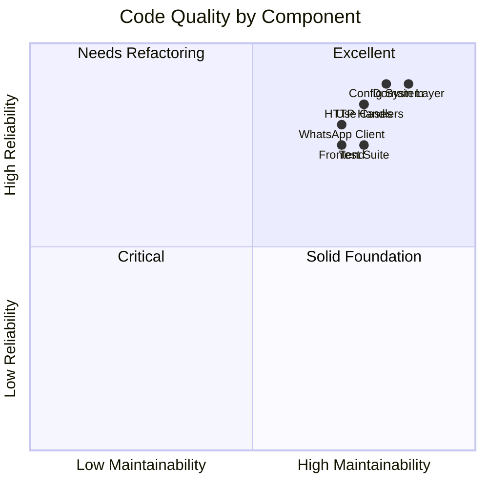

# Whatspire Project Analysis Report

> **Comprehensive Phase-by-Phase Analysis** | Generated: 2026-02-07

## Executive Summary

**Whatspire** is a production-ready WhatsApp Business API platform (v2.0.0) built as a monorepo:

| Component | Stack | Status |
|-----------|-------|--------|
| **Backend** | Go 1.24, Gin, GORM, whatsmeow | Production-Ready |
| **Frontend** | React 19, Tauri 2.9, TanStack | Active Development |

---

## Phase 1: Core Infrastructure & Domain Foundation

### Objectives
Establish Clean Architecture with domain-driven design, enabling testability and flexibility.

### Implemented Features

| Layer | Files | Purpose |
|-------|-------|---------|
| **Domain** | 27 files | Entities, repositories, value objects, errors |
| **Application** | 20 files | Use cases, DTOs |
| **Infrastructure** | 49 files | WhatsApp, persistence, webhooks, config |
| **Presentation** | 15 files | HTTP handlers, WebSocket, middleware |

### Deliverables

| Artifact | Count | Key Files |
|----------|-------|-----------|
| Entities | 10 | Session, Message, Contact, Group, Event, Media, Presence, Reaction, Receipt, APIKey |
| Repository Interfaces | 11 | Session, WhatsApp, Event, Contact, Message, Presence, Reaction, Receipt, Audit, Queue |
| Value Objects | 5 | MessageContent, Status types |

### ✅ Pros
- Excellent separation of concerns with dependency rule enforcement
- Interface-driven design enables testing and flexibility
- Domain layer has zero external dependencies
- Uber/fx dependency injection throughout

### ⚠️ Cons
- Value objects underutilized (5 vs 10 entities)
- Some coupling in infrastructure wiring

---

## Phase 2: WhatsApp Integration

### Objectives
Robust WhatsApp Web API integration with resilience patterns.

### Implemented Features

### Deliverables

| Component | File | Lines | Purpose |
|-----------|------|-------|---------|
| Core Client | `client.go` | 657 | Main WhatsApp operations |
| Connection | `client_connection.go` | ~200 | Connect, disconnect, QR |
| Groups | `client_groups.go` | ~280 | Group management |
| Messaging | `client_messaging.go` | ~300 | Send messages |
| Circuit Breaker | `circuit_breaker.go` | ~130 | Fault tolerance |
| Retry Logic | `retry.go` | ~200 | Exponential backoff |
| Message Parser | `message_parser.go` | ~450 | Parse incoming messages |
| Media Uploader | `media_uploader.go` | ~170 | Media handling |

### Message Type Support

| Type | Send | Receive | Status |
|------|------|---------|--------|
| Text | ✅ | ✅ | Complete |
| Image | ✅ | ✅ | Complete |
| Document | ✅ | ✅ | Complete |
| Audio | ✅ | ✅ | Complete |
| Video | ✅ | ✅ | Complete |
| Reaction | ✅ | ✅ | Complete |
| Receipt | N/A | ✅ | Complete |

### ✅ Pros
- Well-modularized (14 files vs original monolithic design)
- Circuit breaker + exponential backoff retry
- Token bucket rate limiting
- Proper mutex handling with `defer unlock`

### ⚠️ Cons
- `message_parser.go` at 450+ lines could be split further
- Event wiring has some coupling

---

## Phase 3: HTTP API & Real-time Communication

### Objectives
RESTful API with WebSocket support, authentication, and observability.

### API Architecture

### Deliverables

| Handler | File | Size | Purpose |
|---------|------|------|---------|
| Sessions | `handler_sessions.go` | 8.7KB | Session lifecycle |
| Messages | `handler_messages.go` | 5.7KB | Send messages, reactions |
| API Keys | `handler_apikeys.go` | 10.3KB | Key management |
| Events | `handler_events.go` | 4.5KB | Query/replay events |
| Contacts | `handler_contacts.go` | 3.3KB | Contact queries |
| Health | `handler_health.go` | 1.8KB | Health/readiness |

### Middleware Stack

| Order | Middleware | Purpose |
|-------|------------|---------|
| 1 | Recovery | Panic recovery |
| 2 | RequestID | Request tracing |
| 3 | Logging | Structured logs |
| 4 | CORS | Cross-origin |
| 5 | Metrics | Prometheus |
| 6 | RateLimit | IP/key limiting |
| 7 | APIKey | Authentication |
| 8 | Role | Authorization (read/write/admin) |

### ✅ Pros
- Well-organized handler files (split from original 662-line monolith)
- Comprehensive RBAC with three-tier permissions
- Prometheus metrics built-in
- Flexible CORS configuration

### ⚠️ Cons
- Some repetitive auth logic in route registration
- `middleware.go` at 14KB could be split

---

## Phase 4: Persistence & Event System

### Objectives
Database abstraction with SQLite/PostgreSQL support and event publishing.

### Database Schema

### Deliverables

| Repository | File | Purpose |
|------------|------|---------|
| Session | `session_repository.go` | CRUD + status |
| Event | `event_repository.go` | Persistence + query |
| API Key | `api_key_repository.go` | Key management |
| Contact | `contact_repository.go` | Contact storage |
| Message | `message_repository.go` | Message persistence |
| Audit | `audit_logger.go` | Audit trail |

### Event Types

| Event | Description |
|-------|-------------|
| `message.received` | Incoming message |
| `message.sent` | Outgoing confirmed |
| `message.delivered` | Delivery receipt |
| `message.read` | Read receipt |
| `message.reaction` | Emoji reaction |
| `presence.update` | Typing/online |
| `session.connected` | Connection success |
| `session.disconnected` | Connection lost |

### ✅ Pros
- Multi-database support (SQLite dev, PostgreSQL prod)
- Composite publisher (WebSocket + Webhook)
- HMAC-signed webhooks for security
- Event replay for debugging

### ⚠️ Cons
- Some repositories could use optimization
- No caching layer

---

## Phase 5: Configuration & Observability

### Objectives
Flexible configuration with validation and hot-reload.

### Configuration System

### Configuration Sources (Precedence)
1. Environment variables (highest)
2. YAML config file (`config.yaml`)
3. Default values (lowest)

### Health Endpoints

| Endpoint | Type | Purpose |
|----------|------|---------|
| `/health` | Liveness | Process alive |
| `/ready` | Readiness | Dependencies OK |
| `/metrics` | Prometheus | Observability |

### ✅ Pros
- Viper integration with hot-reload
- Comprehensive validation
- YAML + ENV support
- Prometheus metrics

### ⚠️ Cons
- No secrets manager integration
- Config file could be better documented

---

## Phase 6: Testing Infrastructure

### Test Distribution

### Test Coverage

| Category | Files | Framework |
|----------|-------|-----------|
| Property | 32 | rapid, gopter |
| Unit | 19 | testify |
| Integration | 9 | HTTP testing |
| E2E | 1 | Full flows |

### Key Test Files

| Test | Size | Coverage |
|------|------|----------|
| `e2e_flows_test.go` | 33KB | Complete user journeys |
| `config_management_test.go` | 19KB | Configuration scenarios |
| `error_handling_test.go` | 16KB | Error paths |
| `message_reception_test.go` | 15KB | Incoming messages |

### ✅ Pros
- Strong property-based testing (32 files)
- E2E flow coverage
- Organized test structure

### ⚠️ Cons
- No coverage reports in CI
- Some test naming inconsistency

---

## Phase 7: Desktop Frontend

### Objectives
Cross-platform desktop app with modern UI.

### Application Structure

### Routes Implemented

| Route | File | Size | Status |
|-------|------|------|--------|
| Dashboard | `index.tsx` | 11KB | ✅ Complete |
| Sessions List | `sessions/index.tsx` | 6.8KB | ✅ Complete |
| New Session | `sessions/new.tsx` | 19.9KB | ✅ Complete |
| Session Detail | `sessions/$sessionId.tsx` | 1.8KB | ✅ Complete |
| Contacts | `contacts/index.tsx` | - | ✅ Complete |
| Settings | `settings/index.tsx` | - | ✅ Complete |

### UI Components

| Category | Count | Examples |
|----------|-------|----------|
| shadcn/ui | 55 | button, card, dialog, table, tabs |
| Sessions | 4 | session-card, qr-display |
| Settings | 7 | api-settings, theme-settings |
| Core | 7 | sidebar, header, loader, error |

### Technology Stack

| Tech | Version | Purpose |
|------|---------|---------|
| React | 19.2.4 | UI library |
| Tauri | 2.x | Desktop wrapper |
| TanStack Router | Latest | Type-safe routing |
| TanStack Query | Latest | Data fetching |
| Zustand | Latest | State management |
| Tailwind CSS | 4.x | Styling |
| shadcn/ui | Latest | Components |

### ✅ Pros
- **More mature than documented** - Full routes implemented
- Modern stack (React 19, Tauri 2.9)
- 77 components with shadcn/ui
- Error boundaries implemented
- Glassmorphic design system

### ⚠️ Cons
- Some components could use optimization
- Bundle size not yet optimized

---

## Bug Identification

### Confirmed Issues

| ID | Location | Description | Severity | Impact |
|----|----------|-------------|----------|--------|
| B001 | Documentation | `project_analysis.md` outdated - shows frontend as placeholder when it's actually complete | 🟡 Medium | Misleading |
| B002 | Frontend | No API error handling in some hooks | 🟡 Medium | UX impact |

### Potential Issues

| ID | Location | Description | Recommendation |
|----|----------|-------------|----------------|
| P001 | `middleware.go` | 14KB file could be split | Split by concern |
| P002 | `message_parser.go` | 450+ lines | Extract sub-parsers |
| P003 | Router | Repetitive auth setup | Create middleware factory |
| P004 | Config | No secrets manager | Integrate Vault/SSM |

### Code Quality Matrix

---

## Summary Scorecard

| Aspect | Score | Notes |
|--------|-------|-------|
| Architecture | **9/10** | Excellent Clean Architecture |
| Code Quality | **8/10** | Some large files to split |
| Testing | **8/10** | Strong property testing |
| Documentation | **5/10** | Outdated vs actual code |
| Frontend | **7/10** | More complete than documented |
| **Overall** | **7.5/10** | Production-ready with minor issues |

### Key Recommendations

1. **Update Documentation** - `project_analysis.md` shows outdated frontend status
2. **Split Large Files** - `middleware.go`, `message_parser.go`
3. **Add CI Coverage** - Integrate coverage reports
4. **Secrets Manager** - Consider Vault/SSM integration
5. **Optimize Bundle** - Frontend bundle analysis

---

*Report generated from actual source code analysis - 2026-02-07*
